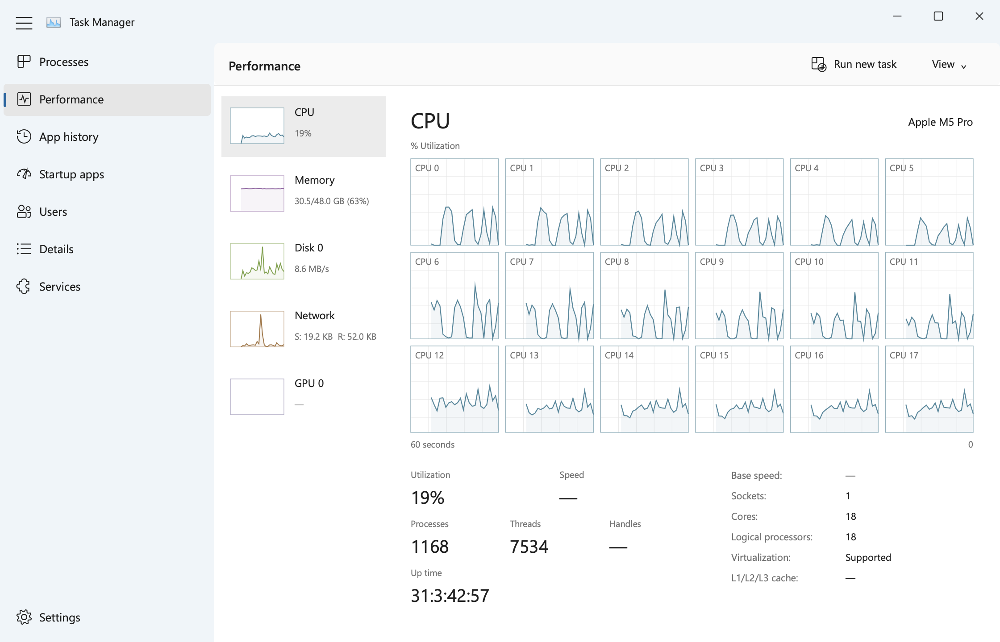

# Task Manager for macOS

**Windows Task Manager's familiar interface. A native Rust app for your Mac.**

An Ultrafast build experiment by [hotredsam](https://github.com/hotredsam). Version 2 rewrites the app in Rust with native AppKit drawing and a small C bridge to public macOS monitoring APIs. No browser, Electron, Swift runtime, or web view is involved in the Rust executable.

The interface follows the [Windows 11 reference screenshots](VISUAL_REFERENCES.md): right-hand window controls, eight navigation pages, grouped processes, sortable resource columns, context menus, and live performance graphs. [The component audit](COMPONENT_AUDIT.md) and [parity notes](PARITY.md) distinguish implemented behavior from remaining differences. This is an independent project, not an official Microsoft or Apple application.



## Compatibility

Targets **M1 and later M-series Macs on macOS 14 or later**. The build uses general `arm64`, with processor counts and metrics discovered at runtime.

Physically tested on a **16-inch MacBook Pro (2026), model Mac17,8, Apple M5 Pro with 18 CPU cores and 48 GB RAM**, running macOS 26.5.1. Rust 1.98.1 and Apple Command Line Tools were used. Other M-series configurations and older supported macOS releases are compatibility targets, not separately hardware-tested claims. Intel is outside this build's support target.

## Download and build

[Download the Apple Silicon app](https://github.com/hotredsam/task-manager-macos/releases/latest). The bundle is locally signed, not notarized; building from source is also supported.

Install a current stable Rust toolchain, Apple Command Line Tools, and Python 3. Then:

```sh
git clone https://github.com/hotredsam/task-manager-macos.git
cd task-manager-macos
./test.sh
./build.sh
open "../Task Manager.app"
```

The scripts use locked Cargo dependencies and target macOS 14. The resulting application is ad-hoc signed; it is not notarized. Move it to Applications, launch it, and choose **Options → Keep in Dock** from its Dock menu.

The former Swift implementation remains in `Sources/` and `Tests/` as a historical baseline. `build-swift.sh` and `test-swift.sh` build/test that baseline. The main build and CI use Rust; the Rust binary links only the C `SystemBridge` source from that directory.

## Using it

- **Processes / Details:** click a header to sort and reverse it; the selected header has shading and a direction chevron. Resize columns by dragging their edges; use View → Select columns to change visibility. Search names, paths, bundle IDs, PIDs, and owners. Expand app groups with their disclosure arrows. Command-click and Shift-click select multiple rows.
- **Process actions:** End task requests termination; More → Force quit terminates immediately. Both confirm and revalidate PID, start time, and owner before signaling. Critical/system/other-user processes and groups containing them are protected. Properties shows identity, path, arguments, open-file count, and available signing information, with scrolling and Copy details.
- **Performance:** choose CPU, Memory, Disk 0, Network, or GPU 0. Right-click CPU → Change graph to → Logical processors. Kernel overlays, graph summary view, and copying are supported. Double-click a main graph to toggle summary; Escape exits it.
- **Efficiency mode:** controls the current power source's actual macOS Low Power Mode for the whole Mac. A confirmation explains this scope; macOS asks for administrator authorization. Turning it off restores the saved previous mode, including High Power where supported. Other power-source profiles are preserved. It is not Windows per-process EcoQoS.
- **App history:** records observed CPU time locally. Show history for all processes is optional. Windows-only network/notification accounting is explicitly unavailable.
- **Startup apps / Services:** inspect launchd jobs and eligible LaunchAgents. Start/stop/restart or enable/disable only applies to validated current-user, non-Apple LaunchAgents. Open Services leads to macOS Login Items & Extensions for authoritative system management.
- **Users:** expand a user to see their processes. System service accounts are excluded. Disconnect is unavailable.
- **Settings:** start page, update interval, pause, window behavior, grouping, history visibility, graph interval, units, theme, and launch at login. Login registration uses Apple's ServiceManagement API and may need approval in System Settings.

Command-1…8 switches pages; Command-F searches; Command-N runs an application; F5 refreshes; Control-Tab cycles pages. Arrow keys navigate/expand rows, Tab moves through commands, Enter activates a focused command or opens properties, Delete requests End task, and Escape dismisses menus/dialogs. Option-Space opens the window menu; Option-F4 closes. Maximize uses the current screen's usable area and restores its previous frame.

## Implementation and data

| Area | Implementation |
|---|---|
| UI | Rust, objc2, native AppKit; custom Windows-style drawing, native text editing, accessible controls |
| Processes | libproc, BSD identity checks, Mach CPU-time conversion, bundle metadata |
| CPU | Mach host and per-processor tick deltas, runtime core counts, sysctl metadata |
| Memory | Host VM counters, resident process memory, swap usage |
| Disk | Published IOKit block-storage totals, permitted process I/O counters, statfs capacity |
| Network | BSD counters for active physical interfaces; aggregate send/receive |
| Services | launchctl inventory and plist metadata; bounded subprocess output/timeouts |
| Power | ProcessInfo state plus administrator-authorized, allowlisted pmset commands and readback |

Sampling and service discovery run on independent workers. The UI uses bounded, latest-only deliveries, virtualized rows, cached drawing attributes, and deferred icon loading. Open menus, confirmations, and drags keep their backing snapshot stable. History is capped at 5,000 entries; graph samples and timing buffers are bounded. Data and preferences stay in `~/Library/Application Support/TaskManager/`; the app does not upload them.

## Performance and verification

The response target is **8 ms of app-side work per interaction**. Timings include the shared action handler and synchronous drawing submission; they do **not** measure display scanout, macOS scheduling, or input-to-photon latency. See [VERIFICATION.md](VERIFICATION.md) for measured results and limitations. A Rust rewrite alone is not proof of a universal 8 ms bound.

## Limitations

GPU utilization/engine counters, per-process network use, dynamic CPU clocks, Windows handles, disk active-time percentage, NUMA controls, affinity masks, and Windows dumps are not fabricated. Disk/network pages currently aggregate devices. Services and memory accounting retain macOS semantics. Native font rasterization, dialogs, Snap Layout hover behavior, and some table interactions differ from Windows. Exact pixel identity across operating systems and complete Windows feature equivalence are not claimed.

## License

Original source code is **MIT**; see [LICENSE](LICENSE). The original Windows Task Manager icon and proprietary Windows artwork remain third-party assets, excluded from MIT. The icon build verifies the source PNG representations pixel-for-pixel. Segoe UI is used only when already installed (including a licensed Office installation); the bundled fallback is Microsoft's open-source Selawik font. See [THIRD_PARTY_NOTICES.md](THIRD_PARTY_NOTICES.md).
